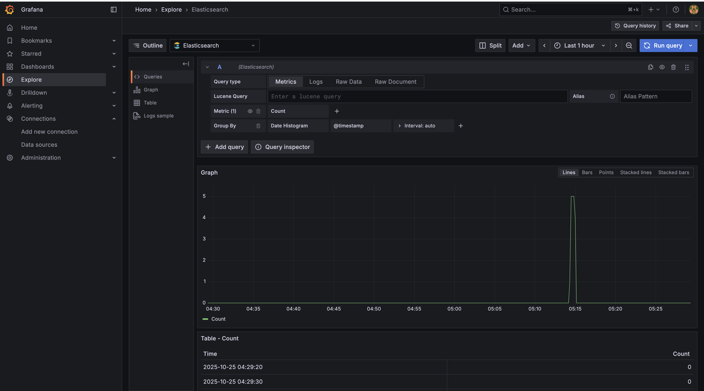
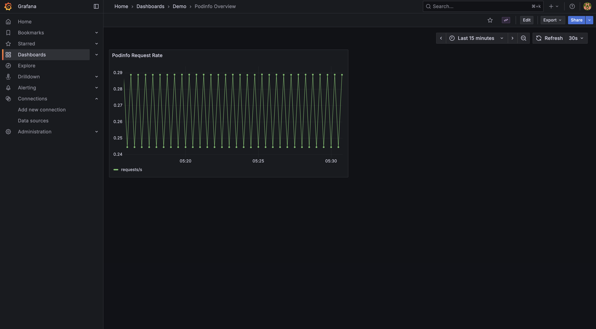

# Monitoring Demo Stack

Grafana + Prometheus + podinfo sample application, provisioned with Kustomize to demonstrate dashboards and alerting data flow.

## Prerequisites
- Docker (required by kind)
- [kind](https://kind.sigs.k8s.io/) ≥ 0.20
- kubectl configured to talk to the kind cluster

## Spin Up Kubernetes
```bash
kind create cluster --name grafana-demo
kubectl config use-context kind-grafana-demo
```

## Deploy Monitoring Stack
From the repository root, apply the root Kustomization to install Prometheus, Grafana, Elasticsearch, and the podinfo demo app (includes the demo-data job that seeds an Elasticsearch index):
```bash
kustomize build --enable-helm monitoring | kubectl apply -f -
kubectl rollout status deploy/prometheus -n monitoring
kubectl rollout status deploy/grafana -n monitoring
kubectl rollout status deploy/podinfo -n monitoring
kubectl rollout status statefulset/elasticsearch-master -n monitoring
```

## Access the UIs
```bash
# Grafana
kubectl port-forward svc/grafana 3000:3000 -n monitoring
# Prometheus
kubectl port-forward svc/prometheus 9090:9090 -n monitoring
```
- Grafana UI: http://localhost:3000 (default admin user/pass is `admin`/`admin`)
- Prometheus UI: http://localhost:9090

Grafana auto-provisions two data sources:
- **Prometheus** (default) for metrics.
- **Elasticsearch** pointing at `https://elasticsearch-master:9200` with credentials `elastic/changeme` and TLS verification disabled for the demo.

In Grafana, the pre-provisioned **Prometheus** data source and **Podinfo Overview** dashboard load automatically. Generate traffic with:
```bash
kubectl port-forward svc/podinfo 9898:9898 -n monitoring 
curl -s localhost:9898/ 
```
Refresh the dashboard to confirm request metrics appear.

In Grafana’s Explore view, switch to the Elasticsearch data source and query `demo-metrics` (for example `value: *`) to verify the seeded documents.

Shortcut to the prebuilt Podinfo dashboard: [Podinfo Overview](http://localhost:3000/d/podinfo-demo/podinfo-overview?orgId=1&from=now-15m&to=now&timezone=browser&refresh=30s)

Quick link to the Elasticsearch Explore view seeded for this demo: [Elasticsearch Explore](http://localhost:3000/explore?schemaVersion=1&panes=%7B%22x68%22%3A%7B%22datasource%22%3A%22elasticsearch%22%2C%22queries%22%3A%5B%7B%22refId%22%3A%22A%22%2C%22datasource%22%3A%7B%22type%22%3A%22elasticsearch%22%2C%22uid%22%3A%22elasticsearch%22%7D%2C%22query%22%3A%22%22%2C%22alias%22%3A%22%22%2C%22metrics%22%3A%5B%7B%22type%22%3A%22count%22%2C%22id%22%3A%221%22%7D%5D%2C%22bucketAggs%22%3A%5B%7B%22type%22%3A%22date_histogram%22%2C%22id%22%3A%222%22%2C%22settings%22%3A%7B%22interval%22%3A%22auto%22%7D%2C%22field%22%3A%22%40timestamp%22%7D%5D%2C%22timeField%22%3A%22%40timestamp%22%7D%5D%2C%22range%22%3A%7B%22from%22%3A%22now-1h%22%2C%22to%22%3A%22now%22%7D%2C%22compact%22%3Afalse%7D%7D&orgId=1)




## Tear Down
```bash
kustomize build --enable-helm monitoring | kubectl delete -f -
kind delete cluster --name grafana-demo
```

## Extension Plan
- Carve out a reusable base under `monitoring/base` that contains the shared namespace, Prometheus, Grafana, podinfo, and Elasticsearch definitions.
- Create environment overlays (e.g. `monitoring/overlays/dev` and `monitoring/overlays/prod`) that reference the base and layer on environment-specific patches—image tags, replica counts, Helm values, and secrets.
- Update delivery tooling: either have CI/CD call `kustomize build monitoring/overlays/<env>` per environment, or adopt Argo CD with an app-of-apps pattern that points at the overlays for continuous delivery.
- Expand observability by adding a log-forwarder that ships pod logs into Elasticsearch, and extend the Grafana provisioning with an Elasticsearch datasource plus a log dashboard to demonstrate metrics + logs in one view.
